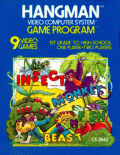

# Hangman 

[!badge Easy]

Hangman is a pencil and paper spelling game. The player attempts to guess the letters in a word. They are only allowed a certain number of incorrect guesses before the game ends. My main experience of it was something that teachers did towards the end of a lesson at school, if we had run out of things to learn. The first video game version was released in 1976.

Hangman is an easy game to try and create. It relies on basic string manipulation, logical flows and has almost nothing in the way of graphics. It is actually a nice first game to try. I created my own version for this tutorial.

You can find the code for the game [here](https://github.com/greytape/hangman)

You can play a version of the game [here](https://greytape.github.io/hangman/)

In this version:

- I took a list of words from the internet.
- I found 10 hangman images online, and then just stepped through them whenever the player got an answer wrong.
- I restarted the game when it had finished.