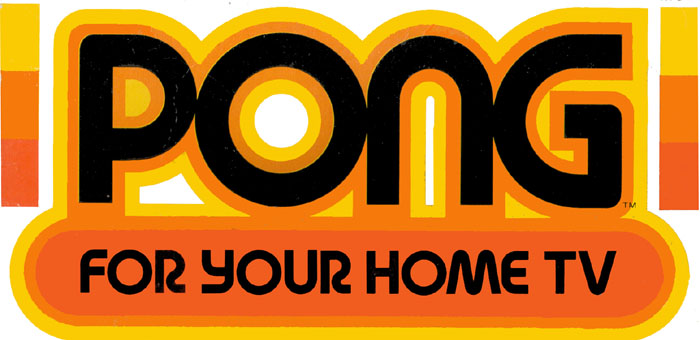

[!badge Medium]

Pong is one of the very first computer games, [released in 1972](https://en.wikipedia.org/wiki/Pong). It was also the first computer game that made any money, which set us on the road to the big budget game industry that we have today.

This version is taken from an excellent code tutorial from _codeheir.com_, which you can find [here](https://codeheir.com/2019/02/04/how-to-code-pong-1972-1/).

The game uses the [p5.js](https://p5js.org/) javascript library. This is a library that has a lot of built-in support for rendering images, and interacting with the user, which makes it great for simple games development.

Generally, it's best to try and stay away from frameworks and libraries when learning to code. They speed up development, but abstract away a lot of the logic. You should learn to add and subtract with a pen and paper before starting to use a calculator. Similarly, you should work without a framework first. This will helps you understand what the framework is actually doing under the hood.

Therefore, I'd recommend only attempting this project once you've already created another javascript game.

You can find the code for the game [here](https://github.com/greytape/pong). 

You can find a working version of the game [here](https://greytape.github.io/pong/).

Possible extensions:

- make a two player version, rather than relying on the AI
- add a scoring system
- make the size of the paddles change as you play the game. Perhaps your paddle should shrink in size if you're winning to try and even up the game?
